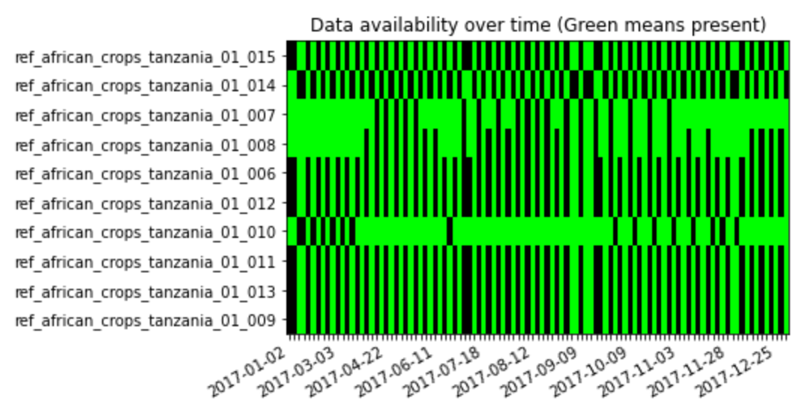

# `mlhub`

A python library for downloading data from https://www.mlhub.earth/#datasets

A lot of this code is copied from `https://github.com/radiantearth/mlhub-tutorials`, with a few additional functions
for data exploration.

### Quickstart

Install by downloading this repository, and (from the repository root) running

```bash
pip install -e .
```

To start, you will need to add your API token to interact with the mlhub API. In addition, if you want to download source images from AWS, you will need to add your AWS credentials. The buckets are [Requester Pays](https://docs.aws.amazon.com/AmazonS3/latest/dev/RequesterPaysBuckets.html) buckets, which means you will get charged for each download.

```python
import mlhub

mlhub.set_token(
    "token123"
)

mlhub.set_aws_credentials(
    aws_access_key="access123",
    aws_secret_key="secret123",
)
```

You can then explore which collections are available:

```python
collections = mlhub.get_collections()
```

And download a collection

```python
from pathlib import Path

download_location = Path("../data")

mlhub.download_collection(
    collection_id="ref_african_crops_tanzania_01",
    download_path=download_location,
    ignore_source_images=False
)
```
If `ignore_source_images=True`, then no source images are downloaded, only the labels and the documentation. If you are not downloading the source images, there is no need for any AWS credentials.

In addition, you can explore different collections, for instance by seeing the availability of source images across features and timesteps:

```python
assets = mlhub.get_all_assets("ref_african_crops_uganda_01")
assets_df = mlhub.features_to_df(assets)
dates_df = mlhub.check_dates_across_features(assets_df)
mlhub.plot_range(dates_df)
```
Would yield the following plot:



More of these plots can be found in the [exploration notebook](notebooks/Exploration.ipynb)
